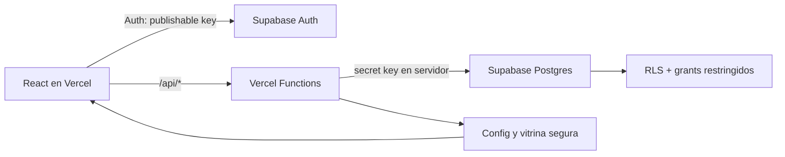

# OpenAI Build Week Manta

Landing y plataforma operativa para la Community Buildathon de OpenAI Build Week en Manta, Ecuador. El sistema acompana el evento: registro global de equipos, seleccion de retos, entrega de demos, mentoria, jurado, rubrica configurable, ranking privado y vitrina publica.

La experiencia conserva la landing cinematografica existente. La integracion visible se limita al boton **Registra tu equipo** y a una seccion de proyectos que solo aparece cuando administracion publica entregas verificadas.

## Estado verificado

- Produccion: `https://oaibuildathon.vercel.app`.
- Repositorio: `israelgo93/oaibuildathon`.
- Supabase: proyecto `buildathon`, referencia publica `iexmlbslfnckrdtkwuir`.
- Estado real, endpoints, migraciones y brechas: [`docs/IMPLEMENTATION_STATUS.md`](docs/IMPLEMENTATION_STATUS.md).
- Contrato archivado de la iteracion implementada: [`docs/NEXT_ITERATION_PROMPT.md`](docs/NEXT_ITERATION_PROMPT.md).

La plataforma esta **implementada, desplegada y verificada en produccion**: incluye obligatorios visibles, borrador incompleto, entrega final estricta, selector de tecnologias, deadline por reto, restricciones para jurado, confirmacion transaccional con Resend y analisis IA no vinculante. El historial completo de doce migraciones y las variables requeridas de Production estan reconciliados. Un registro real confirmo el envio del correo mediante el outbox.

## Ejes tematicos desplegados

Produccion incorpora ejes tematicos y listas de ideas para cada reto. El panel administrativo puede editar ambas listas; el registro, el portal del equipo y mentoria las presentan como contexto de construccion. La migracion `20260714205820_add_challenge_themes.sql` precarga contenido para agentes y automatizacion, herramientas para builders e impacto local.

La migracion, los tipos, la API publica, el registro y el portal del equipo estan verificados en produccion. Una prueba temporal de recuperacion mostro los 6 ejes y 8 ideas del reto de agentes y elimino todos sus datos al terminar. La ruta administrativa mantiene autenticacion obligatoria y el bundle desplegado contiene ambos campos y sus payloads; esta verificacion no repitio un guardado autenticado porque no habia una sesion administrativa disponible.

## Acceso de staff y difusion

Produccion incorpora credenciales temporales para staff, cambio obligatorio, recuperacion de contrasena y una seccion administrativa de difusion. Al crear un mentor o jurado, administracion puede escribir una clave temporal o dejar que el servidor genere una de 16 caracteres; el correo se envia con instrucciones segun el rol. Los perfiles existentes se notifican solo mediante una accion explicita individual, de pendientes o masiva. Las acciones masivas excluyen administradores y nunca se ejecutan durante una migracion o despliegue.

La difusion acepta hasta 500 correos unicos desde texto, TXT o CSV con columna `email` o `correo`, muestra una vista previa y exige confirmacion. El servidor limita el contenido a texto plano y CTA internas, congela la campana en Supabase y usa lotes Resend de hasta 100 destinatarios con idempotencia estable. Una accion administrativa recupera campanas en cola, interrumpidas o parciales y solo reintenta errores transitorios. Las migraciones, API y vistas estan desplegadas y verificadas en el alias canonico; la comprobacion uso datos ficticios y no envio mensajes ni cambio claves reales.

La misma seccion incluye un modo de entrega de creditos: administracion importa un archivo `.xlsx`, `.csv` o `.txt` cuya primera fila contiene las columnas `correo`, `apicredit` y `codexcredit`. Cada destinatario recibe una plantilla fija en espanol con su codigo de creditos de la API de OpenAI, los pasos para canjearlo en `platform.openai.com` (Settings > Organization > Billing > Promotions) y un boton con su enlace personal para reclamar los creditos de Codex. El cliente valida correo, codigo y URL HTTPS por fila antes de enviar; el servidor revalida con Zod, exige unicidad de correos y persiste los datos en la misma cola durable de difusion, por lo que la reanudacion y los reintentos funcionan igual que en el mensaje general.

## Analisis IA de entregas desplegado

Produccion incorpora un analisis automatico y no vinculante para cada nueva revision final `submitted`. Cuatro especialistas del OpenAI Agents SDK revisan en paralelo la alineacion con el reto, el producto desplegado, el codigo/arquitectura y la integracion de OpenAI; un quinto agente sintetiza un informe estructurado, limitaciones, preguntas sugeridas y una posible ponderacion basada en la rubrica activa. Esa ponderacion es solo una referencia: no completa el formulario del jurado, no escribe `evaluations` ni sustituye la revision humana.

El servidor obtiene evidencia antes de invocar a los agentes. La demo se consulta con limites de red, tiempo y tamano, y el repositorio se inspecciona de forma acotada sin clonar, compilar ni ejecutar codigo. HTML, README, nombres de archivos y codigo se tratan como datos no confiables, no como instrucciones. Administracion puede abrir el panel lateral y reintentar informes fallidos o desactualizados; un jurado solo puede consultar los proyectos que tiene asignados.

`submission_ai_analyses` funciona como outbox durable por revision: el trigger encola, un claim atomico asigna un lease con token de ejecucion unico y cada escritura final queda cercada por ese token. Los reintentos conservan un codigo de error seguro y acumulan los tokens consumidos incluso si un agente falla despues de respuestas parciales. El envio inicia el trabajo en segundo plano con `waitUntil`; por separado, un cooldown idempotente de 30 segundos absorbe dobles clics sobre la misma revision. El cron diario procesa como maximo dos analisis en paralelo para recuperar trabajo pendiente sin disparar costo o concurrencia sin limite. Publicar conserva el analisis si `submitted_at` no cambia, mientras volver a borrador o reenviar marca el informe anterior como desactualizado.

Un `PATCH` final identico sobre una entrega que ya esta `submitted` es idempotente durante 30 segundos: conserva `submitted_at` y evita dobles clics. Despues de esa ventana, o al volver a borrador y reenviar, crea una revision aunque las URLs sean iguales, porque el deploy o repositorio externo puede haber cambiado. Cada entrega recibe hasta cinco revisiones automaticas; despues se reutiliza un unico marcador de cuota y administracion puede autorizar un reintento manual auditado. El hash de contenido cerca cada worker contra cambios no reflejados en la revision, pero no omite reanalisis legitimos posteriores a la ventana.

La migracion `20260715051406_add_submission_ai_analysis.sql` esta aplicada como la numero 12 del historial remoto. `OPENAI_API_KEY` y `CRON_SECRET` existen como variables Sensitive de Vercel Production; el secreto del cron fue rotado y su autorizacion se verifico sin exponer valores. El deployment vigente `dpl_FbbFjdiZXdFB2G8gG6Dve3Q8DnRc` esta `READY` en el alias canonico, conserva 12 Functions y termino con build limpio.

La comprobacion real autorizada del worker proceso una entrega con capacidad de lote 2. El registro termino `completed` con `gpt-5.5`, cuatro informes especialistas, informe final, evidencia, ponderacion y confianza persistidos; la evidencia contiene 11 elementos `verified` y uno `partial`. La validacion local termino con TypeScript estricto, 137 pruebas, auditoria sin vulnerabilidades y dos builds limpios. En esta verificacion no hubo una sesion autenticada para volver a recorrer visualmente el panel lateral de administracion o jurado; su acceso y representacion permanecen cubiertos por contratos y pruebas, pero esa comprobacion visual desplegada queda pendiente.

## Capacidades

- Registro unico por equipo para 1, 2 o 3 participantes.
- Un reto activo por equipo y control opcional de cupos.
- Ejes tematicos y temas sugeridos editables por reto y visibles durante seleccion, construccion y mentoria.
- Sesion de equipo mediante cookie HTTP-only y codigo de recuperacion.
- Portal para guardar el proyecto como borrador o enviarlo al jurado.
- Vitrina publica de proyectos aprobados en la landing.
- Supabase Auth para administradores, jurados y mentores.
- Clave temporal, cambio obligatorio y recuperacion neutral para cuentas internas.
- Panel administrativo para el evento existente mas reciente, etapas, fechas globales, limites, retos, rubrica, equipos, participantes, staff, difusion, asignaciones, proyectos y ranking privado.
- Panel de jurado con formulario dinamico de calificacion.
- Panel lateral de analisis IA no vinculante para administracion y jurados asignados.
- Panel de mentor con equipos, integrantes, reto, avance y enlaces.
- Rubrica inicial de 100 puntos orientada a construccion.
- Auditoria de mutaciones de gestion y staff, y validacion Zod en las Functions.

## Limites actuales de produccion

- El panel incluye un selector de evento, permite crear eventos nuevos (con copia opcional de la rubrica activa) y filtra equipos, retos, entregas, asignaciones, difusion y resultados por el evento seleccionado.
- La UI no desactiva ni elimina usuarios; la notificacion de acceso rota la clave solo despues de una confirmacion administrativa.
- El campo `results_public` existe, pero no hay una vista ni un endpoint publico de resultados.
- El registro manual que reutiliza `/api/registrations` todavia no crea una entrada propia de auditoria administrativa.
- No existe webhook de entrega, rebote o queja; el estado `sent` confirma que Resend acepto el mensaje, no su entrega final en el buzon.
- La verificacion de produccion del analisis IA cubrio migracion, secretos, worker y persistencia; no repitio visualmente el panel autenticado por falta de una sesion disponible.

Supabase contiene el deadline por reto, el outbox y las invariantes nuevas. La aplicacion publicada hace cumplir los deadlines, oculta borradores al jurado y exige una entrega final completa. El detalle verificable esta en la documentacion de estado y en el prompt archivado de la iteracion.

## Rutas

| Ruta | Uso |
| --- | --- |
| `/` | Landing y vitrina condicional |
| `/registro` | Registro global de un equipo |
| `/equipo` | Recuperacion de sesion y entrega del proyecto |
| `/login` | Acceso de organizacion, jurado y mentores |
| `/cambiar-contrasena` | Cambio obligatorio o recuperacion de una cuenta interna |
| `/admin` | Centro de control de la Buildathon |
| `/jurado` | Evaluacion de equipos asignados |
| `/mentor` | Seguimiento de equipos asignados |

## Arquitectura



El navegador no consulta tablas de negocio directamente. La clave publicable moderna se usa solo para Supabase Auth. Las Vercel Functions aplican validacion y autorizacion antes de usar `SUPABASE_SECRET_KEY`.

### Por que no usar `service_role` en el navegador

Supabase recomienda las claves modernas:

- `sb_publishable_...`: segura para el navegador cuando RLS y grants estan bien definidos.
- `sb_secret_...`: exclusiva de servidores confiables; tiene acceso elevado y nunca debe incluirse en una variable `VITE_`.

La clave legada `service_role` no es necesaria para esta implementacion. Si un proyecto antiguo aun la usa, debe migrarse a una secret key moderna antes de produccion.

## Stack

- React 19, React Router y TypeScript estricto.
- Vite y Framer Motion.
- Three.js para la escena ambiental de la landing.
- Vercel Functions para la API.
- Supabase Postgres y Supabase Auth.
- Resend para correo transaccional mediante outbox, remitente verificado e idempotencia.
- OpenAI Agents SDK para cuatro analisis especialistas y una sintesis estructurada.
- Zod para contratos de entrada.
- Vitest para reglas de dominio.

## Desarrollo local

Requisitos: Node.js 22 o 24 LTS, npm y, para ejecutar Supabase local, Docker Desktop.

```powershell
npm install
Copy-Item .env.example .env.local
npm run typecheck
npm test
npm run build
```

Para trabajar solo en la landing:

```powershell
npm run dev
```

En `npm run dev`, Vite no ejecuta las Vercel Functions de `api/`; solo las lecturas publicas `/api/showcase` y `/api/public-config` se proxyan hacia produccion (ver `vite.config.ts`) para que la vitrina y el countdown muestren datos reales. El resto de `/api/*` requiere el runtime local de Vercel una vez configuradas las variables:

```powershell
npx vercel@latest dev
```

## Configuracion de Supabase

No reutilices un proyecto de otra aplicacion. Crea o identifica un proyecto exclusivo para la Buildathon y conserva su `project ref`.

### 1. Enlazar y aplicar la migracion

Descubre primero las opciones actuales del CLI:

```powershell
npx supabase@2.109.1 --help
npx supabase@2.109.1 link --help
npx supabase@2.109.1 db push --help
```

Luego enlaza y aplica:

```powershell
npx supabase@2.109.1 link --project-ref TU_PROJECT_REF
npx supabase@2.109.1 db push
```

El historial aplicado es:

1. `supabase/migrations/20260713232939_buildathon_initial_schema.sql`: esquema, RLS, funciones transaccionales, retos iniciales y rubrica.
2. `supabase/migrations/20260713233118_harden_security_and_indexes.sql`: endurecimiento de funciones e indices para claves foraneas.
3. `supabase/migrations/20260714000143_fix_profile_role_trigger.sql`: corrige el trigger de perfiles para altas Auth con rol explicito.
4. `supabase/migrations/20260714131805_complete_submission_deadlines_and_email_outbox.sql`: deadline por reto, invariantes de entrega final, restriccion SQL de jurado y outbox transaccional de registro.
5. `supabase/migrations/20260714131931_index_registration_email_outbox_team_event.sql`: indice compuesto para la clave foranea del outbox.
6. `supabase/migrations/20260714132323_fix_assignment_role_trigger.sql`: corrige el trigger compartido para asignar jurados y mentores sin acceder a columnas de la otra tabla.
7. `supabase/migrations/20260714205820_add_challenge_themes.sql`: agrega `thematic_axes text[]` y `suggested_topics text[]`, precarga los tres retos y limita el numero de elementos de cada lista.
8. `supabase/migrations/20260714223749_add_staff_access_and_broadcasts.sql`: agrega estado de credenciales, rate limit con HMAC, campanas/destinatarios de difusion, RLS, grants exclusivos de servidor y funciones atomicas.
9. `supabase/migrations/20260714224056_index_broadcast_campaign_foreign_keys.sql`: cubre las claves foraneas de evento y creador de campana.
10. `supabase/migrations/20260714230812_harden_broadcast_retry_and_idempotency.sql`: agrega clasificacion de errores, claves idempotentes persistidas y reanudacion atomica de campanas interrumpidas.
11. `supabase/migrations/20260714230821_harden_staff_access_and_password_recovery.sql`: preserva el cambio obligatorio durante la activacion y reclama de forma atomica la cuota de recuperacion por correo e IP.
12. `supabase/migrations/20260715051406_add_submission_ai_analysis.sql`: crea el outbox por revision, hash de contenido, cuota automatica acotada, triggers de encolado/invalidez, backfill de entregas finales, indices, RLS, grants exclusivos de servidor y el claim atomico con lease/token de ejecucion.
13. `supabase/migrations/20260721060218_add_credit_broadcast_delivery.sql`: agrega el tipo de campana (`message`/`credit`), columnas acotadas de codigo de API y URL de Codex por destinatario, y la RPC idempotente `create_credit_broadcast_campaign` exclusiva de servidor.

No edites migraciones aplicadas; crea una nueva con:

```powershell
npx supabase@2.109.1 migration new nombre_descriptivo
```

### 2. Auth

En Supabase Dashboard:

- Deshabilita el registro publico de usuarios.
- Configura el Site URL de produccion y las URLs de preview autorizadas.
- Usa contrasenas de al menos 12 caracteres en los flujos de alta y recuperacion.
- Crea staff desde `/admin`; no crees participantes como usuarios Auth.

### 3. Variables

Copia `.env.example` y completa solo el archivo local ignorado por Git:

| Variable | Exposicion | Proposito |
| --- | --- | --- |
| `VITE_SUPABASE_URL` | Navegador | URL del proyecto |
| `VITE_SUPABASE_PUBLISHABLE_KEY` | Navegador | Login de staff |
| `SUPABASE_URL` | Servidor | URL para Functions |
| `SUPABASE_SECRET_KEY` | Servidor | Operaciones privilegiadas |
| `TEAM_SESSION_SECRET` | Servidor | HMAC de sesiones de equipo |
| `VITE_TURNSTILE_SITE_KEY` | Navegador, opcional | Widget anti-bots |
| `TURNSTILE_SECRET_KEY` | Servidor, opcional | Verificacion anti-bots |
| `RESEND_API_KEY` | Servidor | Credencial de Resend; instalar mediante Vercel Marketplace |
| `RESEND_FROM` | Servidor | Debe ser `OpenAI Build Week Manta <noreply@datatensei.ai>` |
| `RESEND_REPLY_TO` | Servidor | Correo real de soporte u organizacion |
| `APP_BASE_URL` | Servidor | URL canonica HTTPS usada en correos; produccion usa `https://oaibuildathon.vercel.app` |
| `OPENAI_API_KEY` | Servidor | Credencial para ejecutar el analisis mediante OpenAI Agents SDK |
| `OPENAI_ANALYSIS_MODEL` | Servidor, opcional | Modelo del analisis; el valor por defecto `gpt-5.5` fue verificado en produccion |
| `GITHUB_TOKEN` | Servidor, opcional | Token de solo lectura para aumentar la cuota al inspeccionar repositorios publicos compatibles |
| `CRON_SECRET` | Servidor | Bearer secreto con el que Vercel autoriza el worker de recuperacion |

La integracion oficial de Supabase en Vercel genera `SUPABASE_URL`, `SUPABASE_PUBLISHABLE_KEY` y `SUPABASE_SECRET_KEY`. Para esta aplicacion Vite crea en Vercel los alias `VITE_SUPABASE_URL` y `VITE_SUPABASE_PUBLISHABLE_KEY` con los valores publicos correspondientes, y genera `TEAM_SESSION_SECRET` de forma independiente. Nunca crees un alias `VITE_` para `SUPABASE_SECRET_KEY`.

Genera `TEAM_SESSION_SECRET` en PowerShell sin reutilizar otra clave:

```powershell
[Convert]::ToBase64String([Security.Cryptography.RandomNumberGenerator]::GetBytes(48))
```

### 4. Administrador inicial

Agrega temporalmente a `.env.local`:

```text
BOOTSTRAP_ADMIN_EMAIL=
BOOTSTRAP_ADMIN_PASSWORD=
BOOTSTRAP_ADMIN_NAME=
```

Ejecuta:

```powershell
npm run admin:bootstrap
```

Antes de ejecutarlo, confirma que `SUPABASE_URL` y `SUPABASE_SECRET_KEY` corresponden al proyecto esperado. Despues:

1. Inicia sesion en `/login` con el usuario creado.
2. Confirma el rol `admin` y el acceso real a `/api/admin/dashboard`.
3. Elimina `BOOTSTRAP_ADMIN_EMAIL`, `BOOTSTRAP_ADMIN_PASSWORD` y `BOOTSTRAP_ADMIN_NAME` de todos los entornos.
4. Rota o elimina cualquier cuenta temporal de prueba que ya no sea necesaria.

Nunca documentes ni publiques las credenciales del administrador inicial. Los siguientes usuarios se crean desde `/admin`.

### 5. Comprobaciones de base de datos

Con Docker y Supabase local activos:

```powershell
npx supabase@2.109.1 start
npx supabase@2.109.1 db reset
npx supabase@2.109.1 db lint --local
```

Despues de enlazar produccion, revisa los asesores de seguridad y rendimiento en Supabase Dashboard o mediante las herramientas del proyecto.

### 6. Tipos de base de datos

El codigo de la aplicacion importa los tipos revisados desde `src/types/database.ts`. El comando:

```powershell
npm run supabase:types
```

genera `src/types/database.generated.ts`. No sustituye automaticamente el archivo usado por la aplicacion: compara ambos, incorpora las tablas o columnas nuevas en `database.ts` y ejecuta el typecheck antes de confirmar el cambio.

## Despliegue en Vercel

1. Enlaza el repositorio `israelgo93/oaibuildathon` con el proyecto Vercel.
2. Configura todas las variables para Production y las necesarias para Preview/Development.
3. No pegues secretos en comandos, commits, issues o logs compartidos; usa el formulario seguro de Vercel o `vercel env add` de forma interactiva.
4. Despliega y valida `/`, `/registro`, `/equipo`, `/login` y los paneles por rol.

El analisis IA ya esta habilitado en Production: la migracion `20260715051406_add_submission_ai_analysis.sql` ocupa la posicion 12 del historial remoto, `OPENAI_API_KEY` y `CRON_SECRET` estan configuradas como Sensitive y el worker autorizado completo una entrega real. Para otro entorno o una recuperacion futura, conserva este orden: aplicar y reconciliar la migracion, configurar los secretos server-only, confirmar Fluid Compute, redeployar y verificar `queued -> running -> completed` sin publicar secretos ni ejecutar codigo del proyecto.

`vercel.json` configura el build de Vite, el fallback del SPA y cabeceras de seguridad. Las rutas `/api/*` permanecen como Functions. El proyecto usa el plan Hobby: para respetar su limite de 12 Functions por deployment, Auth, las acciones administrativas agrupadas y el panel/detalle del jurado usan dispatchers dinamicos sin cambiar las URLs publicas. El deployment verificado `dpl_FbbFjdiZXdFB2G8gG6Dve3Q8DnRc` contiene esos 12 entrypoints, asigna hasta 300 segundos a las Functions que inician o procesan el trabajo y programa `/api/admin/analysis-worker` a las `03:00 UTC` cada dia; ese worker tambien acepta `POST` de una sesion de administracion para drenar la cola durante el evento.

## Flujo operativo recomendado

1. Administracion revisa fechas, abre registro y publica los retos.
2. Una persona registra cada equipo completo.
3. Administracion crea mentores y jurados, confirma el envio de sus accesos y realiza asignaciones.
4. Los equipos construyen y completan su entrega.
5. Al enviar una revision final, el sistema encola el analisis IA y prepara el informe no vinculante para administracion y el jurado asignado.
6. Administracion abre la etapa de calificacion.
7. Los jurados contrastan el informe con la demo, el codigo y su propio criterio antes de calificar todos los criterios.
8. Administracion verifica demos, publica proyectos y revisa el ranking privado.
9. `results_public` puede configurarse, pero la exposicion publica de resultados requiere una implementacion adicional.

## Correo de registro con Resend

El repositorio incluye el SDK de Resend, plantilla HTML/texto, idempotencia, reintentos clasificados y un outbox creado en la misma transaccion del registro. Un fallo de correo no revierte ni duplica el equipo, y administracion puede reintentar pendientes. Resend esta autorizado desde Vercel Marketplace; `RESEND_API_KEY`, `RESEND_FROM`, `RESEND_REPLY_TO` y `APP_BASE_URL` estan configuradas en Production. Un registro real termino con estado `sent`, un intento e ID de proveedor. Preview debe usar configuracion separada para no enviar correos reales. El contrato completo esta en [`docs/NEXT_ITERATION_PROMPT.md`](docs/NEXT_ITERATION_PROMPT.md).

## Correo de acceso, recuperacion y difusion

Las claves temporales se generan con criptografia del servidor y nunca se guardan en tablas, auditoria, respuestas o logs. Para cuentas existentes, Resend debe aceptar primero el correo y solo entonces se activa la clave nueva; si el proveedor falla, la clave anterior permanece valida. Cada reenvio marca cambio obligatorio en `profiles` y un trigger sobre Auth libera el bloqueo cuando el usuario cambia realmente su contrasena. La temporalidad se garantiza por ese cambio obligatorio, no por una fecha de vencimiento que Supabase Auth no pueda hacer cumplir. La recuperacion publica responde siempre con el mismo `202`, exista o no la cuenta, reclama atomicamente limites por hashes HMAC de correo/IP y envia un enlace de Supabase Auth mediante Resend.

Las campanas guardan asunto, mensaje plano, CTA interna y destinatarios normalizados. `sent` significa aceptacion de Resend, no entrega final. No se usa CC/BCC ni se permite enviar HTML, remitentes o URLs arbitrarias desde el navegador.

## Assets de la landing

Los originales se conservan en `Assets/` y el navegador consume las versiones optimizadas de `public/assets/`. Para regenerar derivados:

```powershell
npm run optimize:assets
```

Revisa `Assets/Generated/README.md` antes de sustituir archivos. El video orbital de runtime es `public/assets/video-orbital.mp4`, servido como `/assets/video-orbital.mp4`; la copia fuente esta en `Assets/video-orbital.mp4`. El video solo se monta en la composicion cinematografica de escritorio, se limita a su ancho intrinseco de 1280 px y recorre el primer 72% de su duracion. Tablet vertical, movil y `prefers-reduced-motion` usan los WebP estaticos y no descargan ni montan el video.

## Rubrica inicial

| Criterio | Maximo |
| --- | ---: |
| Producto funcional | 30 |
| Uso de OpenAI y Codex | 25 |
| Ejecucion tecnica | 20 |
| Experiencia y demo | 15 |
| Impacto y aprendizaje | 10 |

Los criterios, maximos, pesos y estados son configurables. El ranking usa el promedio de evaluaciones finales, normalizado por el maximo ponderado activo.

## Seguridad y privacidad

- `.env*` esta ignorado; `.env.example` contiene solo marcadores.
- RLS esta habilitado en todas las tablas publicas.
- `anon` y `authenticated` no tienen grants directos sobre tablas de negocio.
- Los registros de equipos se crean en una funcion SQL transaccional.
- Correos de participantes no forman parte de la vitrina publica.
- Los tokens de sesion se guardan como HMAC y viajan en cookies HTTP-only.
- Los rate limits de recuperacion guardan HMAC de correo e IP, nunca los valores originales.
- Las respuestas publicas proyectan solo campos aprobados.
- `OPENAI_API_KEY`, `GITHUB_TOKEN` y `CRON_SECRET` son exclusivos de servidor y nunca llevan prefijo `VITE_`; los informes no exponen trazas, prompts ni errores internos del proveedor.
- La evidencia externa se limita y valida antes del modelo; los agentes no reciben herramientas de red y nunca ejecutan codigo de los equipos.
- Solo administracion y el jurado asignado pueden leer el informe; la sugerencia IA no modifica la rubrica ni la evaluacion oficial.
- CSP, HSTS, proteccion contra iframes y politicas de permisos se configuran en Vercel.
- Turnstile puede activarse para el registro publico sin cambiar el codigo.

Antes de produccion define una politica de privacidad, retencion y eliminacion de datos personales acorde al evento.

## Calidad

```powershell
npm run typecheck
npm test
npm audit
npm run build
```

No se permite `any` ni `as any`. Toda consulta Supabase debe tener un tipo `Tables<>` explicito. Las instrucciones completas estan en `AGENTS.md`.

## Estructura relevante

```text
.
|-- .agents/skills/               # Conocimiento reusable para agentes
|-- api/                          # Vercel Functions
|   |-- admin/
|   |-- judge/
|   `-- mentor/
|-- server/                       # Seguridad, Auth, validacion y sesiones
|-- docs/                         # Estado verificado y contrato de iteracion archivado
|-- src/
|   |-- components/
|   |-- landing/                 # Landing por escenas, contenido congelado, orbita, countdown y CSS cinematografico
|   |   |-- scenes/
|   |   |-- LandingPage.tsx
|   |   |-- content.ts
|   |   `-- landing-cinematic.css
|   |-- lib/
|   |-- pages/
|   `-- types/
|-- supabase/migrations/          # Esquema versionado
|-- AGENTS.md
|-- PRODUCT.md
`-- vercel.json
```

## Documentacion para agentes

- `AGENTS.md`: reglas de implementacion y seguridad.
- `docs/IMPLEMENTATION_STATUS.md`: comportamiento desplegado, limitaciones y migraciones.
- `docs/NEXT_ITERATION_PROMPT.md`: contrato autocontenido de la iteracion ya implementada y archivada.
- `.agents/skills/landing-maintenance`: mapa y limites de la landing.
- `.agents/skills/buildathon-operations`: dominio, esquema y flujos operativos.
- `PRODUCT.md`: direccion visual, tono y accesibilidad.
- `VIDEO_SCROLL_PLAN.md`: contrato tecnico vigente del video orbital sincronizado con scroll.
