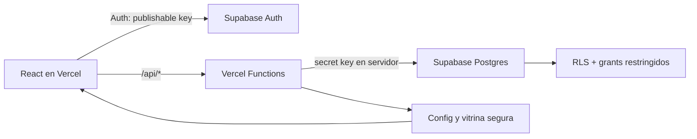

# OpenAI Build Week Manta

Landing y plataforma operativa para la Community Buildathon de OpenAI Build Week en Manta, Ecuador. El sistema acompana el evento completo: registro global de equipos, seleccion de retos, entrega de demos, mentoria, jurado, rubrica configurable, resultados y vitrina publica.

La experiencia conserva la landing cinematografica existente. La integracion visible se limita al boton **Registra tu equipo** y a una seccion de proyectos que solo aparece cuando administracion publica entregas verificadas.

## Capacidades

- Registro unico por equipo para 1, 2 o 3 participantes.
- Un reto activo por equipo y control opcional de cupos.
- Sesion de equipo mediante cookie HTTP-only y codigo de recuperacion.
- Portal para guardar el proyecto como borrador o enviarlo al jurado.
- Vitrina publica de proyectos aprobados en la landing.
- Supabase Auth para administradores, jurados y mentores.
- Panel administrativo para evento, etapas, fechas, limites, retos, rubrica, equipos, participantes, staff, asignaciones, proyectos y ranking.
- Panel de jurado con formulario dinamico de calificacion.
- Panel de mentor con equipos, integrantes, reto, avance y enlaces.
- Rubrica inicial de 100 puntos orientada a construccion.
- Auditoria de acciones privilegiadas y validacion Zod en las Functions.

## Rutas

| Ruta | Uso |
| --- | --- |
| `/` | Landing y vitrina condicional |
| `/registro` | Registro global de un equipo |
| `/equipo` | Recuperacion de sesion y entrega del proyecto |
| `/login` | Acceso de organizacion, jurado y mentores |
| `/admin` | Centro de control de la Buildathon |
| `/jurado` | Evaluacion de equipos asignados |
| `/mentor` | Seguimiento de equipos asignados |

## Arquitectura



El navegador no consulta tablas de negocio directamente. La clave publicable moderna se usa solo para Supabase Auth. Las Vercel Functions aplican validacion y autorizacion antes de usar `SUPABASE_SECRET_KEY`.

### Por que no usar `service_role` en el navegador

Supabase recomienda las claves modernas:

- `sb_publishable_...`: segura para el navegador cuando RLS y grants estan bien definidos.
- `sb_secret_...`: exclusiva de servidores confiables; tiene acceso elevado y nunca debe incluirse en una variable `VITE_`.

La clave legada `service_role` no es necesaria para esta implementacion. Si un proyecto antiguo aun la usa, debe migrarse a una secret key moderna antes de produccion.

## Stack

- React 19, React Router y TypeScript estricto.
- Vite y Framer Motion.
- Three.js para la escena ambiental de la landing.
- Vercel Functions para la API.
- Supabase Postgres y Supabase Auth.
- Zod para contratos de entrada.
- Vitest para reglas de dominio.

## Desarrollo local

Requisitos: Node.js 22 o 24 LTS, npm y, para ejecutar Supabase local, Docker Desktop.

```powershell
npm install
Copy-Item .env.example .env.local
npm run typecheck
npm test
npm run build
```

Para trabajar solo en la landing:

```powershell
npm run dev
```

Para probar tambien `/api/*`, usa el runtime local de Vercel una vez configuradas las variables:

```powershell
npx vercel@latest dev
```

## Configuracion de Supabase

No reutilices un proyecto de otra aplicacion. Crea o identifica un proyecto exclusivo para la Buildathon y conserva su `project ref`.

### 1. Enlazar y aplicar la migracion

Descubre primero las opciones actuales del CLI:

```powershell
npx supabase@2.109.1 --help
npx supabase@2.109.1 link --help
npx supabase@2.109.1 db push --help
```

Luego enlaza y aplica:

```powershell
npx supabase@2.109.1 link --project-ref TU_PROJECT_REF
npx supabase@2.109.1 db push
```

La migracion `supabase/migrations/20260713174601_buildathon_initial_schema.sql` crea el esquema, RLS, funciones transaccionales, retos iniciales y rubrica. No edites esa migracion despues de aplicarla; crea una nueva con:

```powershell
npx supabase@2.109.1 migration new nombre_descriptivo
```

### 2. Auth

En Supabase Dashboard:

- Deshabilita el registro publico de usuarios.
- Configura el Site URL de produccion y las URLs de preview autorizadas.
- Usa contrasenas de al menos 10 caracteres.
- Crea staff desde `/admin`; no crees participantes como usuarios Auth.

### 3. Variables

Copia `.env.example` y completa solo el archivo local ignorado por Git:

| Variable | Exposicion | Proposito |
| --- | --- | --- |
| `VITE_SUPABASE_URL` | Navegador | URL del proyecto |
| `VITE_SUPABASE_PUBLISHABLE_KEY` | Navegador | Login de staff |
| `SUPABASE_URL` | Servidor | URL para Functions |
| `SUPABASE_SECRET_KEY` | Servidor | Operaciones privilegiadas |
| `TEAM_SESSION_SECRET` | Servidor | HMAC de sesiones de equipo |
| `VITE_TURNSTILE_SITE_KEY` | Navegador, opcional | Widget anti-bots |
| `TURNSTILE_SECRET_KEY` | Servidor, opcional | Verificacion anti-bots |

Genera `TEAM_SESSION_SECRET` en PowerShell sin reutilizar otra clave:

```powershell
[Convert]::ToBase64String([Security.Cryptography.RandomNumberGenerator]::GetBytes(48))
```

### 4. Administrador inicial

Agrega temporalmente a `.env.local`:

```text
BOOTSTRAP_ADMIN_EMAIL=
BOOTSTRAP_ADMIN_PASSWORD=
BOOTSTRAP_ADMIN_NAME=
```

Ejecuta:

```powershell
npm run admin:bootstrap
```

Elimina esos tres valores del entorno despues de confirmar el acceso. Los siguientes usuarios se crean desde `/admin`.

### 5. Comprobaciones de base de datos

Con Docker y Supabase local activos:

```powershell
npx supabase@2.109.1 start
npx supabase@2.109.1 db reset
npx supabase@2.109.1 db lint --local
```

Despues de enlazar produccion, revisa los asesores de seguridad y rendimiento en Supabase Dashboard o mediante las herramientas del proyecto.

## Despliegue en Vercel

1. Enlaza el repositorio `israelgo93/oaibuildathon` con el proyecto Vercel.
2. Configura todas las variables para Production y las necesarias para Preview/Development.
3. No pegues secretos en comandos, commits, issues o logs compartidos; usa el formulario seguro de Vercel o `vercel env add` de forma interactiva.
4. Despliega y valida `/`, `/registro`, `/equipo`, `/login` y los paneles por rol.

`vercel.json` configura el build de Vite, el fallback del SPA y cabeceras de seguridad. Las rutas `/api/*` permanecen como Functions.

## Flujo operativo recomendado

1. Administracion revisa fechas, abre registro y publica los retos.
2. Una persona registra cada equipo completo.
3. Administracion crea mentores y jurados y realiza asignaciones.
4. Los equipos construyen y completan su entrega.
5. Administracion abre la etapa de calificacion.
6. Los jurados califican todos los criterios de sus equipos.
7. Administracion verifica demos, publica proyectos y revisa el ranking.
8. Solo si corresponde, activa resultados publicos.

## Rubrica inicial

| Criterio | Maximo |
| --- | ---: |
| Producto funcional | 30 |
| Uso de OpenAI y Codex | 25 |
| Ejecucion tecnica | 20 |
| Experiencia y demo | 15 |
| Impacto y aprendizaje | 10 |

Los criterios, maximos, pesos y estados son configurables. El ranking usa el promedio de evaluaciones finales, normalizado por el maximo ponderado activo.

## Seguridad y privacidad

- `.env*` esta ignorado; `.env.example` contiene solo marcadores.
- RLS esta habilitado en todas las tablas publicas.
- `anon` y `authenticated` no tienen grants directos sobre tablas de negocio.
- Los registros de equipos se crean en una funcion SQL transaccional.
- Correos de participantes no forman parte de la vitrina publica.
- Los tokens de sesion se guardan como HMAC y viajan en cookies HTTP-only.
- Las respuestas publicas proyectan solo campos aprobados.
- CSP, HSTS, proteccion contra iframes y politicas de permisos se configuran en Vercel.
- Turnstile puede activarse para el registro publico sin cambiar el codigo.

Antes de produccion define una politica de privacidad, retencion y eliminacion de datos personales acorde al evento.

## Calidad

```powershell
npm run typecheck
npm test
npm audit
npm run build
```

No se permite `any` ni `as any`. Toda consulta Supabase debe tener un tipo `Tables<>` explicito. Las instrucciones completas estan en `AGENTS.md`.

## Estructura relevante

```text
.
|-- .agents/skills/               # Conocimiento reusable para agentes
|-- api/                          # Vercel Functions
|   |-- admin/
|   |-- judge/
|   `-- mentor/
|-- server/                       # Seguridad, Auth, validacion y sesiones
|-- src/
|   |-- components/
|   |-- lib/
|   |-- pages/
|   `-- types/
|-- supabase/migrations/          # Esquema versionado
|-- AGENTS.md
|-- PRODUCT.md
`-- vercel.json
```

## Documentacion para agentes

- `AGENTS.md`: reglas de implementacion y seguridad.
- `.agents/skills/landing-maintenance`: mapa y limites de la landing.
- `.agents/skills/buildathon-operations`: dominio, esquema y flujos operativos.
- `PRODUCT.md`: direccion visual, tono y accesibilidad.
